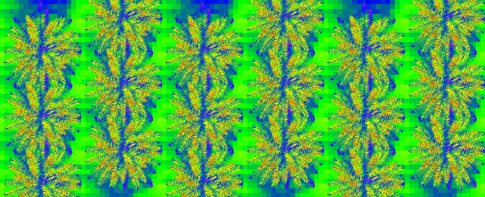

```{r setup, include=FALSE}
knitr::opts_chunk$set(echo = TRUE, warning=FALSE,message=FALSE)
```

## Introduction

Recurrent droughts caused by El Niño in Indonesia have a strong impact on both rice (Naylor, 2007) and oil palm cultivation. Mixing rice cultivation and palm trees in intercropping systems could alleviate those issues. The palm trees would be planted at lower density, and the rice would be grown during the wet season. The competition for water during dry periods could be reduced between palms thanks to a lower tree density, while sustaining the profitability for the stakeholders thanks to the production of rice in the interrow.
The feasibility of such a system, however, requires adjusting the density of palm trees in the plantation to maintain a relatively high annual production of oil *and* rice using shade-adapted rice varieties. 

The objective of this project is to evaluate the genetic variability of the tolerance to shade in rice to target varieties adapted to shade. Shade-tolerant rice varieties will be selected using an experimental set-up.
The longer-term objective is to initiate a large-scale research project to test different palm-rice agroforestry systems and a rice breeding program adapted to these systems.

## Material and Methods

### Field experiment

The experimental set-up consisted of rice plots grown under full sun or artificial shade. A net placed above the rice plots were used as artificial shade. In order to get a realistic level of shade, the nets were set-up to intercept as much light as intercepted by palm trees.

### Modelling

The ARCHIMED model was used to simulate the light transmitted by the palm trees to a plane at 1 meter above the ground. This modelling approach help to compute the light transmitted according to any planting design.

## General workflow

The modelling workflow follows several steps:  

1. Make the planting design (see `Design_plot` project)  
1. Make the 3D mock-ups of the palm trees at two different ages  
1. Build a 3D scene  
1. Make the simulations using ARCHIMED  
1. Import the results and analyse them  

## Simulations

### ARCHIMED initializations

```{r echo=T, message=FALSE, include=FALSE}
library(tidyverse)
library(data.table)
library(lubridate)
library(archimedR)
library(Vpalmr)
library(ggplot2)
library(ggimage)
library(viridis)
library(plotly)
Sys.setenv(TZ="UTC")
```

#### Path to ARCHIMED

Setting the path to ARCHIMED on the system:  
```{r}
path_archimed= "D:/OneDrive - cirad.fr/Travail_AMAP/Softwares/ARCHIMED/Archimed__penman_medlyn"
```
This path has to be adapted to where ARCHIMED is located in the computer.

#### Meteo file

We only simulate the ephemeris of march for this pre-study, at half-hourly time-step, clearness of 75% (*i.e.* sunny day), and mean temperature of 24:

```{r}
timestep= 30*60 # 30 minutes
clearness= 0.75
sim_date= data.frame(date= as.POSIXct("2019-03-20"), clearness= 0.5)
```

The time steps will start from 05:00 to 18:30 by 30 minutes time-step. A dynamic of air temperature is generated from a minimum and maximum daily temperature (18 and 30°C resp.).

```{r}
Hour= seq(from= as.POSIXct("2019-01-01 05:00:00"), by= timestep, 
          to = as.POSIXct("2019-01-01 18:30:00"))

# Dummy temperatures in the day:
Tair= archimedR::temperature_dynamic(Tmax = 30, Tmin = 18, per = (24*60*60)/timestep,
                                     shift = 3*pi/2)[10:37]

Meteo= 
  expand.grid(date= sim_date$date, hour_start= Hour)%>%
  arrange(date,hour_start)%>%
  mutate(hour_end= format(hour_start+timestep,"%H:%M:%S"),
         hour_start= format(hour_start,"%H:%M:%S"),
         temperature= Tair,
         relativeHumidity= 90,
         clearness= clearness)%>%
  mutate(date= format(date, "%Y/%m/%d"), wind= 3)
```

The meteo file is saved into the ARCHIMED input folders:  

```{r}
data.table::fwrite(Meteo,sep=";",file = 'Designs/meteo_palm_rice.csv')
```

and ARCHIMED is set to use it:

```{r}
archimedR::set_config(file = "Designs/ArchimedConfiguration.properties", parameter = "meteoFile", value = "meteo_palm_rice.csv")
```

#### General parameters

* Site location (Latitude= 0.9261918, Altitude = 45)  
* 46 sky sectors for the turtle to compute the diffuse light  
* 200.000 pixels for the pixel table to compute light interception  


```{r}
site_location= list(Latitude= 0.9261918, Altitude = 45)
set_config(file = "Designs/ArchimedConfiguration.properties", parameter = "latitude", value = site_location$Latitude)
set_config(file = "Designs/ArchimedConfiguration.properties", parameter = "altitude", value = site_location$Altitude)

archimedR::set_config(file = "Designs/ArchimedConfiguration.properties", parameter = "skySectors", value = 46)
archimedR::set_config(file = "Designs/ArchimedConfiguration.properties", parameter = "numberOfPixels", value = 200000)
```

And finally the output directory:

```{r}
sim_folder= "Designs/output_palm_rice"
set_config(file = "Designs/ArchimedConfiguration.properties", parameter = "outputDirectory", value = basename(sim_folder))
```

### Making the 3D scene using VPalmr (or VPALM-IDE)

To simulate the different designs, we need first the 3D mock-ups of the palm trees (OPF files) and their planting design (OPS files).  

We only need an average palm tree for this study, so we use the parameters from an average palm tree. The scene is made using `VPalmr`. A less advanced user may prefer to make the scenes using VPALM-IDE instead.

### Importing the data

Several files are imported :  

* The planting designs data.frames (*2).  

* The parameters input to VPALM, for each physiological age. 

Creating and writing the OPF and OPS:

```{r echo = T, results = 'hide', message=FALSE}
planting_designs= list.files("Designs/planting_design", full.names = TRUE)
palm_param_files= list.files("Designs/Palm_parameters", full.names = TRUE)
param_df= 
  expand.grid(param_file= palm_param_files, 
              design= planting_designs,stringsAsFactors = FALSE)%>%
  mutate(name= basename(.data$design)%>%gsub(".csv","",.))

# Cleaning: 
if(dir.exists("Designs/Vpalm_outputs")){
  unlink("Designs/Vpalm_outputs", recursive = TRUE)
}
# Making the OPF and first OPS: 
designs= 
  lapply(1:length(palm_param_files), function(x){
    params= readRDS(param_df[x,1])
    design= data.table::fread(file = param_df[x,2], data.table = FALSE)
    # Making the scene:
    scene= 
      Vpalmr::make_scene(data = params,
                         path = file.path("Designs","Vpalm_outputs"), 
                         AMAPStudio = "Designs/vpalm.jar",
                         plot_design= design)
    # Remove whole average:
    list.files(file.path("Designs","Vpalm_outputs","scenes"),
               full.names = TRUE)%>%
      .[grep("Average_MAP",.)]%>%
      unlink(x = .)
    
    list.files(file.path("Designs","Vpalm_outputs","scenes","opf"),
               full.names = TRUE)%>%
      .[grep("Average_Average_MAP",.)]%>%
      unlink(x = .)
  })
# Rename scene folder:
file.rename("Designs/Vpalm_outputs/scenes","Designs/Vpalm_outputs/scenes_palm_rice")
# Rename OPS:
list.files(file.path("Designs","Vpalm_outputs","scenes_palm_rice"),
           full.names = TRUE)%>%
  .[grep(".ops",.)]%>%
  file.rename(., {file.path(dirname(.),paste0(basename(.)%>%gsub("\\.ops",'',.),"_",param_df[1,3],".ops"))})
```

Adding the other designs OPS
```{r echo = T, results = 'hide'}
param_df_others= param_df[-c(1:length(palm_param_files)),]

lapply(1:nrow(param_df_others), function(x){
  design= data.table::fread(file = param_df_others[x,2], data.table = FALSE)
  params= readRDS(param_df_others[x,1])
  prog= unique(params$input$Parameter$Progeny)
  map= params$input$MAP_requested
  
  format_ops(design = design, Progeny = prog,
             map = map, average = TRUE)%>% 
    write_ops(file.path("Designs","Vpalm_outputs","scenes_palm_rice", 
                        paste0(prog, "_MAP_", map,"_",param_df_others[x,3], ".ops")),
              overwrite = TRUE)  
})
```


### ARCHIMED simulations

```{r echo = T, results = 'hide'}
scene_path= "Designs/Vpalm_outputs/scenes_palm_rice"
```

Then, running the simulation for each scene

```{r, eval= FALSE}
parameters= list("xMin","yMin","xMax","yMax")
design_files= list.files(scene_path)%>%.[grep('.ops',.)]
# Cleaning the Output folder:
unlink(sim_folder, recursive = T)

#  Reading the model manager: 
model_manager= fread("Designs/models_palmtree.csv", data.table = F)

# NB: if ARCHIMED did not complete the simulation and returned an error, open the OPS file and 
# change the OPF files for ones that worked previously, run a simulation, change back the OPFs
# to the right ones and it may work.
tmp=
  lapply(design_files, function(x){
    # Set the scene boundaries:
    density= x%>%strsplit(.,"_")%>%unlist()%>%.[grep(".ops",.)]%>%gsub(".ops","",.)
    planting_design= data.table::fread(planting_designs[grep(density,basename(planting_designs))],
                                       data.table = FALSE)
    tmp=
      lapply(parameters, function(z){
        value= unique(planting_design[,grep(z,colnames(planting_design), ignore.case = TRUE)])
        set_config(file = "Designs/ArchimedConfiguration.properties",parameter = z, value = value)
      })
    # Set the ops name: 
    path= file.path("Vpalm_outputs","scenes_palm_rice", x)
    set_config(file = "Designs/ArchimedConfiguration.properties", parameter = "file", value = path)
    
    # Updating the model manager:
    model_manager$Node_id[model_manager$Group=="pavement"]= 2 + nrow(planting_design)
    fwrite(model_manager, "Designs/models_palmtree.csv",sep = ";", quote = FALSE)
    
    # Run ARCHIMED:
    run_archimed(exe = file.path(path_archimed,"archimed.jar"), memory= 16384, config= normalizePath("Designs/ArchimedConfiguration.properties", winslash = "/"))
  })%>%unlist()

# Test if the simulations ran successfully:
if(any(!tmp)){
  warning(paste("Error during ARCHIMED simulation for:\n *",paste(names(tmp)[!tmp], collapse = "\n * ")))
}
```

## Results

<!-- The code used below works only if there are only the target simulations into the output folder, so carefully remove other simuations if any, or change the output directory used by ARCHIMED beforehand. -->

```{r include=FALSE}
files_sim= 
  sim_folder%>%
  list.files(recursive = TRUE, full.names = TRUE)

path_nodes= files_sim[grep("nodes_values.csv",files_sim)]
path_meteo= files_sim[grep("meteo.csv",files_sim)]
# path_configs= files_sim[grep(".properties",files_sim)]
```


```{r include=FALSE}
# Importing the meteorology file from the first simulation (all are the same):
meteo= 
  import_meteo(x = file.path(path_meteo[1]))%>%
  mutate(date= as.POSIXct(date)+ seconds(hour_start))
```

```{r include=FALSE}
# Importing the node values (main output):
nodes= 
  lapply(path_nodes, function(x){
    name= 
      x%>%dirname()%>%strsplit(split = "/")%>%unlist()%>%
      head(-1)%>%tail(1)%>%strsplit(split = " ")%>%unlist()%>%head(1)
    # read_out_node(path = x,
    #               duration = data.frame(step= meteo$step,
    #                                     timestep= meteo$timestep))%>%
    data.table::fread(x)%>%mutate(Treatment= name)
  })%>%data.table::rbindlist()%>%tibble::as_tibble()
```


```{r include=FALSE}
ngrid= 
  nodes%>%
  mutate(id_type= ifelse(plantId==-1,"soil","plant"))%>%
  ungroup()%>%
  filter(id_type=="soil")%>%
  filter(stepNumber==stepNumber[1])%>%
  group_by(Treatment)%>%
  summarise(ngrid= n(), area_grid= sum(.data$meshArea))

# Grid index: 
grid_dim= 
  lapply(planting_designs, function(x){
    cbind(
      Treatment= x%>%basename%>%gsub(".csv","",.),
      data.table::fread(x, data.table = FALSE)%>%
      summarise_at(vars(matches("max|min")),unique)
    )
  })%>%data.table::rbindlist(use.names=TRUE)%>%as_tibble()

grid_dim= 
  dplyr::right_join(grid_dim,ngrid%>%mutate(Treatment= gsub("DA1_MAP_[0-9][0-9]_","",Treatment)))%>%
  mutate(
    surf_grid= area_grid/ngrid,
    x_length= xmax-xmin, y_length= ymax-ymin,
    grid_n_x= round(x_length/sqrt(surf_grid)),
    grid_n_y= round(y_length/sqrt(surf_grid))
  )
grid_dim$Treatment= ngrid$Treatment
    
grid_index= 
  lapply(grid_dim$Treatment, function(z){
    grid_= grid_dim[grid_dim$Treatment==z,]
    expand.grid(y= (1:grid_$grid_n_y)*sqrt(grid_$surf_grid),
                x= (1:grid_$grid_n_x)*sqrt(grid_$surf_grid))%>%
      mutate(Treatment= z)%>%
      mutate(id= 1:nrow(.))
  })%>%data.table::rbindlist()%>%as_tibble()

# Reading the trees positions:

trees_positions= 
  lapply(planting_designs, function(x){
    treatment= basename(x)%>%gsub(".csv","",.)
    des_= data.table::fread(x,data.table = FALSE)%>%select(x,y)%>%unlist(.)
    des_%>%matrix(nrow = 1)%>%as.data.frame()%>%setNames(names(des_))%>%
      mutate(Treatment= treatment)
  })%>%data.table::rbindlist()%>%as_tibble()

trees_positions= 
  lapply(trees_positions$Treatment, function(x){
    found= grep(x,grid_dim$Treatment)
    trees_positions[trees_positions$Treatment==x,]%>%
      .[rep(1,length(found)),]%>%
      mutate(Treatment= grid_dim$Treatment[grep(x,grid_dim$Treatment)])
  })%>%data.table::rbindlist()%>%as_tibble()

grid_dist= 
  merge(grid_index,trees_positions,by = "Treatment")%>%
  mutate(dist_tree_1= sqrt((x - x1)^2 + (y - y1)^2),
         dist_tree_2= sqrt((x - x2)^2 + (y - y2)^2),
         dist_tree_x1= abs(x - x1),
         dist_tree_x2= abs(x - x2),
         x_tree_1= x1, x_tree_2= x2)%>%
  mutate(dist_tree= pmin(dist_tree_1,dist_tree_2),
         dist_tree_x= pmin(dist_tree_x1,dist_tree_x2))

plane_df= 
  nodes%>%
  mutate(id_type= ifelse(plantId==-1,"soil","plant"))%>%
  ungroup()%>%
  filter(id_type=="soil")%>%
  mutate(nodeId= nodeId-1)%>% # id 1 was the scene
  # dplyr::left_join(Area_plots, by= "Treatment")%>%
  dplyr::left_join(meteo%>%select(date,step), by= c("stepNumber"= "step"))%>%
  dplyr::left_join(grid_dist, by= c("Treatment","nodeId"= "id"))

plane_df$Treatment= as.factor(plane_df$Treatment)
plane_df$dens= 
  plane_df$Treatment%>%
  forcats::fct_relabel(~substr(., nchar(.)-3+1, nchar(.)))

plane_df$MAP= 
  plane_df$Treatment%>%
  forcats::fct_relabel(~substr(., 9, 10))

plane_df_step= 
  plane_df%>%
  dplyr::mutate(Date= date,
                irradiation= absIrradiance_withScattering_PAR*meshArea*stepDuration,
                irradiance= absIrradiance_withScattering_PAR)
# Global intercepted radiation (irradiation) in J obj-1 timestep-1
# Irradiance: W m-2 

grid_df_day= 
  plane_df_step%>%
  group_by(Treatment,nodeId)%>%
  summarise(Date= mean(.data$date),
            Intercepted= sum(.data$absIrradiance_withScattering_PAR*meshArea*stepDuration),
            # Global intercepted radiation in J grid-1 d-1
            # Area_plot= mean(.data$Area_plot),
            dist_tree= mean(dist_tree),
            dist_tree_x= mean(dist_tree_x),
            dens= unique(dens),
            MAP= unique(MAP),
            x= unique(x),
            y=unique(y),
            x_tree_1= unique(x_tree_1), 
            x_tree_2= unique(x_tree_2))
```


Light transmitted to the soil throughout the day:

* Low density: 

```{r, message=FALSE}
plane_df_step%>%
  filter(Treatment== "DA1_MAP_72_inter11xintra9_d101" |
           Treatment== "DA1_MAP_90_inter11xintra9_d101")%>%
  ggplot(aes(x=x, y=y))+
  facet_wrap(~paste0("Density: ",dens, ", Age: ",MAP),nrow = 2) +
  geom_tile(aes(fill=irradiance))+
  coord_fixed()+
  labs(title = 'Hour: {frame_time}', x = 'x (m)', y = 'y (m)',
       fill= "Irradiance (W m-2)") +
  # scale_fill_gradient(low = "#B30000", high = "#FEF0D9")+
  scale_fill_viridis()+
  # scale_fill_gradientn(
  #   colours = RColorBrewer::brewer.pal(5,name = "OrRd"),
  #   breaks=seq(0,max(irradiance),3),
  #   limits = c(0,max(irradiance)))+
  theme(legend.position="bottom")+
  gganimate::transition_time(Date)
gganimate::anim_save(filename = 'map_light_rice_low_density.gif',path = "outputs")
```


* High density: 

```{r, message=FALSE}
plane_df_step%>%
  filter(Treatment== "DA1_MAP_72_inter10xintra8_d125" |
           Treatment== "DA1_MAP_90_inter10xintra8_d125")%>%
  ggplot(aes(x=x, y=y))+
  facet_wrap(~paste0("Density: ",dens, ", Age: ",MAP)) +
  geom_tile(aes(fill=irradiance*10^6))+
  coord_fixed()+
  labs(title = 'Hour: {frame_time}', x = 'x (m)', y = 'y (m)',
       fill= "Irradiance (W m-2)") +
  scale_fill_viridis()+
  # scale_fill_gradientn(
  #   colours = rev(RColorBrewer::brewer.pal(5,name = "OrRd")),
  #   breaks=seq(0,13,3), 
  #   limits = c(0,13))+
  theme(legend.position="bottom")+
  gganimate::transition_time(Date)
gganimate::anim_save(filename = 'map_light_rice_high_density.gif',path = "outputs")
```

### Light transmitted to the soil according to the distance to the tree

```{r, warning=FALSE,message=FALSE}
plane_df_step%>%
  ggplot(aes(x=dist_tree, y=irradiance))+
  facet_wrap(~paste0("Density: ",dens, ", Age: ",MAP)) +
  geom_point(aes(color= irradiance*10^6), show.legend = FALSE)+
  labs(title = 'Hour: {frame_time}', x = 'Distance to the closest palm tree (m)', 
       y = 'Irradiance (W m-2)')+
  gganimate::transition_time(Date)+
  gganimate::ease_aes('linear')
gganimate::anim_save(filename = 'points_light_rice_distance_to_tree.gif',path = "outputs")
```

### Integrated over a day:

* Low density: 

```{r}
grid_df_day%>%
  filter(Treatment== "DA1_MAP_72_inter11xintra9_d101" |
           Treatment== "DA1_MAP_90_inter11xintra9_d101")%>%
  ggplot(aes(x=x, y=y))+
  facet_wrap(~paste0("Density: ",dens, ", Age: ",MAP)) +
  geom_tile(aes(fill=Intercepted))+
  coord_fixed()+
  labs(x = 'x (m)', y = 'y (m)',fill= "Intercepted (MJ m-2 d-1)") +
  theme(legend.position="bottom")+
  scale_fill_gradientn(
    colours = rev(RColorBrewer::brewer.pal(5,name = "OrRd")),
    breaks=seq(0,13,3), 
    limits = c(0,13))

ggplot2::ggsave(filename = 'Interception_daily_low_density.png',device = "png",
                path = "outputs",
                width = 17,height=12,units="cm",dpi=200,scale = 1.2)
```

* High density: 

```{r warning=FALSE}
grid_df_day%>%
  filter(Treatment== "DA1_MAP_72_inter10xintra8_d125" |
           Treatment== "DA1_MAP_90_inter10xintra8_d125")%>%
  ggplot(aes(x=x, y=y))+
  facet_wrap(~paste0("Density: ",dens, ", Age: ",MAP)) +
  geom_tile(aes(fill=Intercepted))+
  coord_fixed()+
  labs(x = 'x (m)', y = 'y (m)',fill= "Intercepted (MJ m-2 d-1)") +
  theme(legend.position="bottom")+
  scale_fill_gradientn(
    colours = rev(RColorBrewer::brewer.pal(5,name = "OrRd")),
    breaks=seq(0,13,3), 
    limits = c(0,13))

ggplot2::ggsave(filename = 'Interception_daily_high_density.png',device = "png",
                path = "outputs",
                width = 17,height=12,units="cm",dpi=200,scale = 1.2)
```

* Distance to the tree

```{r warning=FALSE}
grid_df_day%>%
  ggplot(aes(x=dist_tree, y=Intercepted))+
  facet_wrap(~paste0("Density: ",dens, ", Age: ",MAP)) +
  geom_point(aes(color= Intercepted), show.legend = FALSE)+
  labs(title = 'Daily transmitted light', x = 'Distance to the closest palm tree (m)', 
       y = 'Irradiance (MJ m-2 d-1)')+
  scale_colour_gradientn(
    colours = rev(RColorBrewer::brewer.pal(5,name = "OrRd")),
    breaks=seq(0,13,3), 
    limits = c(0,13))

ggplot2::ggsave(filename = 'Interception_distance_to_tree_daily.png',device = "png",
                path = "outputs",
                width = 17,height=12,units="cm",dpi=200,scale = 1.2)
```

  
### Light available for the rice:

We considered that the rice crop would be planted at a distance of 3m minimum to enable field workers to manage the palm, and computed hereafter the daily average light available on the strip:   

```{r warning=FALSE}
grid_df_day_row= 
  grid_df_day%>%
  group_by(Treatment,x)%>%
  summarise(Intercepted= mean(Intercepted), 
            dens= unique(dens), MAP= unique(MAP),
            dist_tree_x= unique(dist_tree_x),
            x_tree_1= unique(x_tree_1),
            x_tree_2= unique(x_tree_2))

grid_df_day_row_poly=
  grid_df_day_row%>%
  filter(dist_tree_x<3)%>%
  mutate(tree= ifelse(x<(x_tree_2-3),"Palm 1","Palm 2"))

grid_df_day_row%>%
  ggplot()+
  facet_wrap(~paste0("Density: ",dens)) +
  geom_ribbon(data= grid_df_day_row_poly,
              aes(x= x, ymin=  -Inf, ymax= Inf,
                  y= Intercepted, group= tree), alpha= 0.3)+
  geom_line(aes(x=x, y= Intercepted, color= MAP), size= 1)+
  labs(x = 'x (m)', y= "Intercepted (MJ m-2 d-1)")

ggplot2::ggsave(filename = 'Interception_daily_transect.png',device = "png",
                path = "outputs",
                width = 17,height=12,units="cm",dpi=200,scale = 1.2)
```


The light transmitted to the interrow is in average :

```{r}
interc= 
  grid_df_day_row%>%
  filter(dist_tree_x>3 & (x>x_tree_1&x<x_tree_2))%>%
  rename(Density= dens)%>%
  group_by(Density,MAP)%>%
  summarise(Transmitted= mean(Intercepted), sd= sd(Intercepted))
knitr::kable(interc, caption = "Radiation transmitted by the palm trees to the interrow (>3m from the plam)")
```

### 3D visualizations

```{r eval=FALSE, include=FALSE}
# Making a special scene only for visualization of the repeated voronoi scene (copy and paste a scene output from ARCHIMED before).
# Here we update the ops (rename the opf before, and put them in an opf folder)
rep_design= function(data, voronois= 3, ops_path){
  data_plot= 
    data%>%
    # Repeat the design:
    {
      mat_plot= expand.grid(Row= 1:voronois, Col= 1:voronois)
      mapply(function(Row,Col){
        data%>%
          select(x,y,xmax,ymax,xmin,ymin)%>%
          mutate(xmin= xmax*(Col-1), ymin= ymax*(Row-1),
                 x= x+xmin, y= y+ymin,
                 xmax= xmax*Col, ymax= ymax*Row,
                 Col= Col, Row= Row)
      }, Row= mat_plot$Row, Col= mat_plot$Col)%>%t()%>%as_tibble()%>%
        tidyr::unnest()
    }
  
  data_plot%>%
    mutate(ymin= min(ymin),xmin= min(xmin),ymax= max(ymax),xmax= max(xmax),
           z= 0, scale= 1, inclinationAzimut=0, inclinationAngle=0,  stemTwist=0)%>%
    Vpalmr::format_ops(design = ., Progeny = "DA1", map = paste0("72_", c(0,1)), id = 1,
                       pavement = "new_pave_2.gwa", average = TRUE)%>%
                       {
                         gwa_index= grep(".gwa",.)
                         before= .[1:(gwa_index-1)]
                         after= .[(gwa_index+1):length(.)]
                         before= 
                           c(before,
                             paste(1,gwa_index:(gwa_index+voronois^2-1),"new_pave_2.gwa",
                                   expand.grid(x= unique(data_plot$xmin),
                                               y= unique(data_plot$ymin))%>%
                                     transmute(xy= paste(.data$x,.data$y, sep= '\t'))%>%pull(xy),
                                   0,1,0,0,0,sep='	')
                           )
                         c(before,after)
                       }%>%
    Vpalmr::write_ops(path = ops_path)
}

design_rep= data.table::fread(planting_designs[2],data.table = FALSE)
rep_design(data = design_rep, voronois= 3,
           ops_path= "D:/OneDrive/Travail_AMAP/ARCHIMED/Archimed_feb2019/output_palm_rice/Visu/result_rep.ops")
```

Here is a visualization of the simulated light interception in the 3D scene from above:


